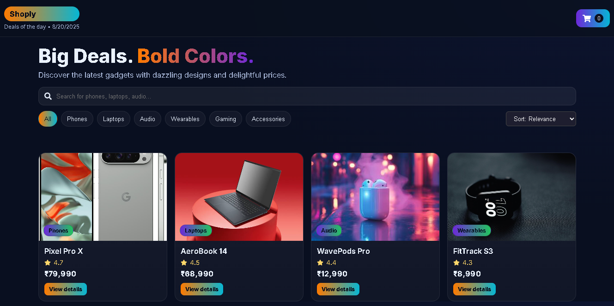
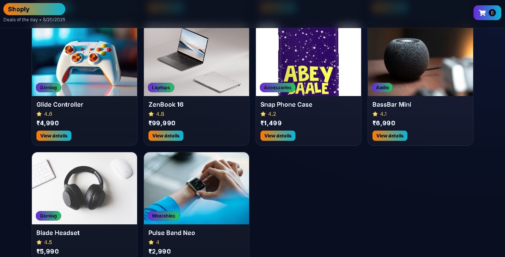
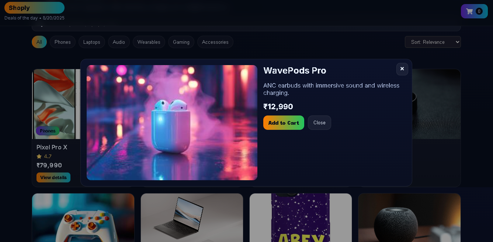
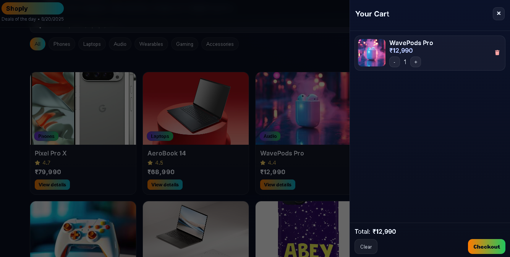

# 🛒 E-Commerce Storefront (React + Vite)

A colorful, modern, and responsive **e-commerce storefront** built with React, Vite, and Framer Motion. 

---

## ✨ Features
- 📱 **Responsive UI** — works on mobile, tablet, and desktop  
- 🎨 **Modern Design** — bold colors, smooth animations (Framer Motion)  
- 🔍 **Search & Filters** — search products by name/description, filter by category  
- ↕️ **Sorting** — sort by price (asc/desc), rating, or relevance  
- 🛍 **Cart System** — add/remove items, increase/decrease quantity  
- ✅ **Checkout Flow** — checkout clears the cart & shows a success notification  
- 🔔 **Toasts** — elegant notifications with `react-toastify`  

---

## 🚀 Tech Stack
- **React 18** (frontend library)  
- **Vite** (fast build tool)  
- **Framer Motion** (animations)  
- **React Toastify** (notifications)  
- **React Icons** (icons)  
- **CSS3** (custom styling)  

---

## 📸 Screenshots

### 🏠 Home Page
<p align="center">
  
  
</p>

### 🛍️ Product Modal


### 🛒 Cart


---

## ⚙️ Installation & Setup

1. Clone the repository:
   ```bash
   git clone https://github.com/your-username/ecommerce-storefront.git
   cd ecommerce-storefront
